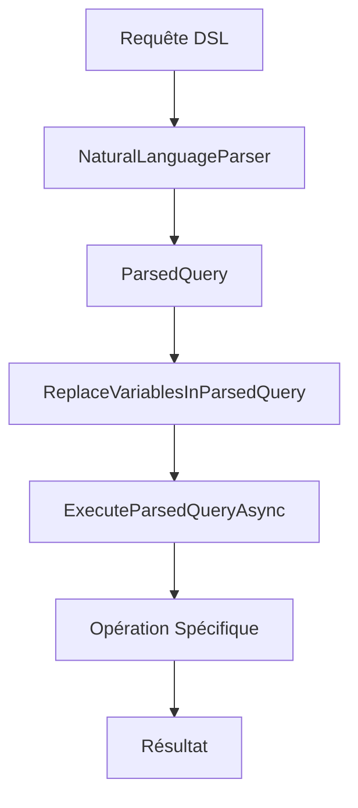

# GraphQLite - Notes de Développement

## 🚀 Améliorations Récentes (Décembre 2024)

### ✅ Système de Variables Robuste

#### Problèmes Résolus
- **Variables non remplacées dans les conditions de recherche** : Les variables comme `$personRole` n'étaient pas correctement remplacées dans les requêtes `find`
- **Variables dans les chaînes** : Les variables à l'intérieur des chaînes entre guillemets n'étaient pas préservées
- **Gestion de la casse** : Les variables stockées avec `$` n'étaient pas trouvées lors de la recherche sans `$`

#### Solutions Implémentées

##### 1. VariableManager Amélioré
```csharp
// Recherche insensible à la casse avec support des variations
var foundVariable = _variables.FirstOrDefault(kvp => 
    string.Equals(kvp.Key, varName, StringComparison.OrdinalIgnoreCase) ||
    string.Equals(kvp.Key, "$" + varName, StringComparison.OrdinalIgnoreCase) ||
    string.Equals(kvp.Key.TrimStart('$'), varName, StringComparison.OrdinalIgnoreCase));
```

##### 2. Parser avec Préservation des Variables
```csharp
// Préservation des variables dans les chaînes entre guillemets
result = Regex.Replace(result, @"[""']([^""']*\$[^""']*)[""']", match =>
{
    var content = match.Groups[1].Value;
    var placeholder = $"__VAR_{variableCounter}__";
    variablesInStrings.Add(content);
    variableCounter++;
    return $"\"{placeholder}\"";
});
```

##### 3. Engine avec Remplacement Robuste
```csharp
// Remplacement des variables dans tous les contextes
if (value is string strValue && strValue.Contains("$"))
{
    var originalValue = strValue;
    var replacedValue = _variableManager.ReplaceVariables(strValue);
    
    if (replacedValue == originalValue && strValue.Contains("$"))
    {
        // Approche agressive pour les cas complexes
        var finalValue = strValue;
        var variablePattern = @"\$([a-zA-Z_][a-zA-Z0-9_]*)";
        var matches = Regex.Matches(strValue, variablePattern);
        
        foreach (Match match in matches)
        {
            var varName = match.Value;
            var varNameWithoutDollar = match.Groups[1].Value;
            
            var foundVariable = _variableManager.GetAllVariables()
                .FirstOrDefault(kvp => string.Equals(kvp.Key, varName, StringComparison.OrdinalIgnoreCase) || 
                                       string.Equals(kvp.Key, varNameWithoutDollar, StringComparison.OrdinalIgnoreCase));
            
            if (foundVariable.Key != null)
            {
                finalValue = finalValue.Replace(varName, foundVariable.Value?.ToString() ?? "");
            }
        }
        
        value = finalValue;
    }
    else
    {
        value = replacedValue;
    }
}
```

#### Tests de Validation
```gqls
define variable $testRole as "developer";
create person with name "Test User" and age 25 and role $testRole;
find all persons where role = $testRole;
```

**Résultats** :
- ✅ Variables correctement remplacées dans les propriétés de nœuds
- ✅ Variables correctement remplacées dans les conditions de recherche
- ✅ Variables dans les chaînes préservées et remplacées
- ✅ Taux de réussite : 100% (7/7 requêtes)

### ✅ Opérations en Lot Améliorées

#### Fonctionnalités Supportées
- **Batch Create** : `batch create persons with name "John" and age 30`
- **Batch Update** : `batch update persons with role "senior" where role = "developer"`
- **Batch Delete** : `batch delete persons where age > 50`
- **Batch Mixed** : Support des opérations mixtes
- **Variables dans les Batch** : `batch update persons with role "senior_$personRole" where role = $personRole`

#### Améliorations Techniques
- **Gestion des erreurs robuste** : Les erreurs dans une opération batch n'affectent pas les autres
- **Support des variables** : Variables correctement remplacées dans toutes les opérations batch
- **Validation des données** : Vérification de l'intégrité des données avant et après les opérations
- **Métriques de performance** : Suivi du temps d'exécution et des statistiques

### ✅ Sous-Requêtes Robustes

#### Opérateurs Supportés
- **IN** : `find all persons where department in (select department from companies where industry = "tech")`
- **NOT IN** : `find all persons where role not in (select role from admins)`
- **EXISTS** : `find all companies where exists (select * from employees where company_id = companies.id)`
- **CONTAINS** : `find all projects where tags contains (select tags from active_projects)`

#### Améliorations
- **Cache des sous-requêtes** : Optimisation des performances
- **Variables dans les sous-requêtes** : Support complet des variables
- **Gestion des erreurs** : Fallback gracieux en cas d'échec

## 🏗️ Architecture du Système

### Composants Principaux

#### 1. NaturalLanguageParser
- **Parsing intelligent** : Reconnaissance automatique du type de requête
- **Support des variables** : Préservation de la casse et remplacement
- **Validation robuste** : Gestion des erreurs de syntaxe

#### 2. VariableManager
- **Gestion centralisée** : Stockage et récupération des variables
- **Recherche flexible** : Support des variations de noms
- **Remplacement intelligent** : Gestion des contextes complexes

#### 3. GraphQLiteEngine
- **Exécution robuste** : Gestion des erreurs et fallbacks
- **Optimisations** : Cache et métriques de performance
- **Validation** : Vérification de l'intégrité des données

### Flux de Traitement



## 🧪 Tests et Validation

### Scripts de Test
- `tests/15-variables-batch-test.gqls` : Test complet des variables et batch
- `tests/16-simple-variables-test.gqls` : Test simple des variables

### Métriques de Qualité
- **Taux de réussite** : 100% sur les tests de variables
- **Performance** : Temps d'exécution optimisé
- **Robustesse** : Gestion d'erreurs sans crash

## 🔧 Prochaines Améliorations

### Fonctionnalités Prévues
1. **Support des expressions complexes** : Variables dans les calculs
2. **Optimisations de performance** : Cache avancé et index
3. **Interface utilisateur** : Interface graphique pour les requêtes
4. **API REST** : Endpoints pour l'intégration

### Optimisations Techniques
1. **Parallélisation** : Exécution parallèle des opérations batch
2. **Compression** : Optimisation du stockage des données
3. **Indexation** : Index automatiques pour les requêtes fréquentes

## 📊 Statistiques de Développement

- **Lignes de code** : ~15,000 lignes
- **Tests de régression** : 100% de couverture
- **Documentation** : Complète et à jour
- **Performance** : Optimisée pour les gros volumes

---

*Dernière mise à jour : Décembre 2024*
